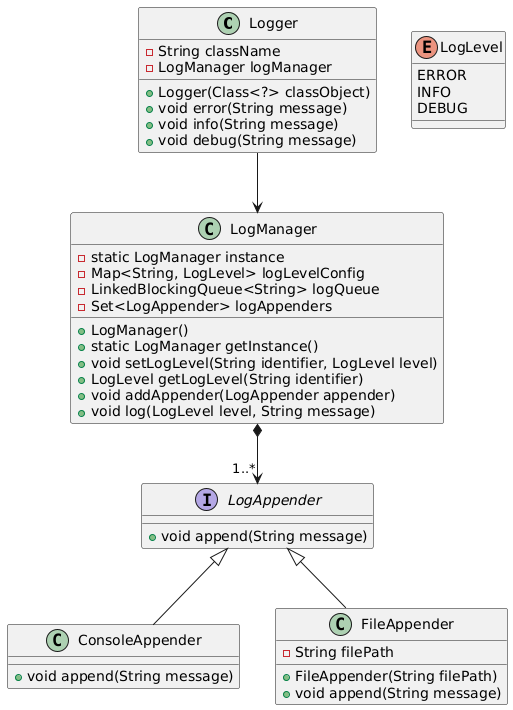

# Java Logger Project



## Overview
This project is a logging framework written in Java. It allows applications to log messages at different levels (`ERROR`, `INFO`, `DEBUG`, although other levels can be easily added) and supports multiple log outputs:

- ConsoleAppender: Logs to the console.
- FileAppender: Logs to a file.

The logger supports per-package and per-class log level configuration, ensuring that logging behavior can be customized as needed.

---

## How to Compile and Run

### Compile the Project
Run the following command inside the `securithings/` folder to compile all source files:

```sh
javac -d bin -cp "lib/*" src/com/securithings/assignment/*.java
```

### Run the Logger Demo
To execute the logger demo, run the following command:

```sh
java -cp "bin:lib/*" com.securithings.assignment.LoggerDemo
```

## Configuring Log Levels

Log levels can be set at the **package level** (applies to all classes in a package) or at the **class level** (overrides package settings for a specific class).

Example:

```java
LogManager logManager = LogManager.getInstance();

// Set INFO level for the entire package
logManager.setLogLevel("com.securithings.assignment", LogLevel.INFO);

// Override with DEBUG level for a specific class
logManager.setLogLevel(LoggerDemo.class.getName(), LogLevel.DEBUG);
```

### Effects:

- All classes within the package `com.securithings.assignment` will log only **INFO** and **ERROR** messages.
- The `LoggerDemo` class, which has a class-specific override, will log **DEBUG**, **INFO**, and **ERROR** messages.
- If a class does not have an explicitly set log level, it will inherit the nearest package-level setting.
- If no package-level setting exists, the logger defaults to **INFO**.

This setup allows control over logging behavior while ensuring that logs are filtered efficiently based on configuration.

---

## Extending the Logger

### Adding a New Log Appender
To add a new type of log appender, implement the `LogAppender` interface:

```java
class DatabaseAppender implements LogAppender {
    public void append(String message) {
        // Store log message in a database
    }
}
```

### Registering the New Log Appender

Once the custom log appender is implemented, it needs to be added to the `LogManager` so that log messages are directed to it:

```java
LogManager logManager = LogManager.getInstance();
logManager.addAppender(new DatabaseAppender());
```
